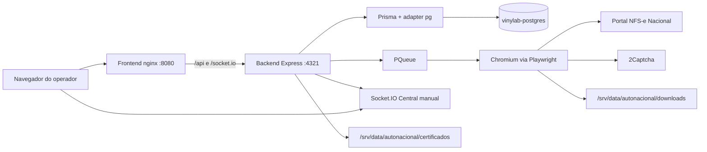

# Arquitetura

O AutoNacional é uma aplicação em dois containers. A automação não é um worker separado: ela roda na mesma instância Node da API.

## Componentes

| Componente | Processo | Função |
|---|---|---|
| Frontend | nginx servindo o build Angular | Telas de empresas, execução, captcha, configurações, contabilidades e rentabilidade |
| Backend | `node dist/main.js` | REST, SSE, Socket.IO e fila |
| PostgreSQL | container já existente `vinylab-postgres` | Dados relacionais |
| Chromium | subprocesso do Playwright, sob Xvfb no container | Login e download no portal |
| Storage de certificados | pasta local ou SFTP | PFX fora do Git |

Não há Redis, fila externa, cron do sistema nem Kubernetes.

## Entrypoints

- Desenvolvimento: `Backend/src/main.ts` via `npm run dev`
- Produção: `Backend/dist/main.js`
- Frontend de desenvolvimento: `ng serve --port 1234`
- Frontend de produção: nginx, com proxy para o serviço `backend`

## API

Rotas montadas em `Backend/src/main.ts`:

- `GET /health` — PostgreSQL e estado da fila
- `/api/settings`, `/api/config`
- `/api/empresas`, `/api/credenciais`, `/api/certificados`, `/api/imports`
- `/api/execucao`, `/api/execucoes`, `/api/validacoes`
- `/api/logs`, `/api/contabilidades`, `/api/relatorios`, `/api/dashboard`
- `/api/nfse`, `/api/metrics`

O progresso da execução usa SSE. A Central manual de captchas usa Socket.IO em `/socket.io`.

## Concorrência

`POST /api/execucao/multiplas` só enfileira. O browser abre dentro do worker da `PQueue`. O limite efetivo é o menor valor entre o padrão, o máximo das settings, os slots visuais e a quantidade de empresas do lote.

## Certificados

`CERT_STORAGE_DRIVER=local` lê `CERT_STORAGE_PATH`. No Compose de produção esse caminho é `/srv/data/autonacional/certificados`, montado do host.

`CERT_STORAGE_DRIVER=sftp` usa `ssh2` com agente SSH ou chave em `CERT_STORAGE_SFTP_PRIVATE_KEY`. A senha do PFX fica criptografada no PostgreSQL; o arquivo não é servido por HTTP.

## Portas

| Porta | Onde | Uso |
|---|---|---|
| 4321 | backend | API, health, Socket.IO |
| 1234 | frontend local | `ng serve` |
| 8080 no host, 80 no container | frontend de produção | UI e proxy |
| 5432 | `vinylab-postgres` | só na rede Docker, sem publicar no host |

## O que o container de produção não faz

Não cria PostgreSQL. Não embute certificado. Não grava download dentro da imagem: downloads, logs e temporários são volumes no host.
