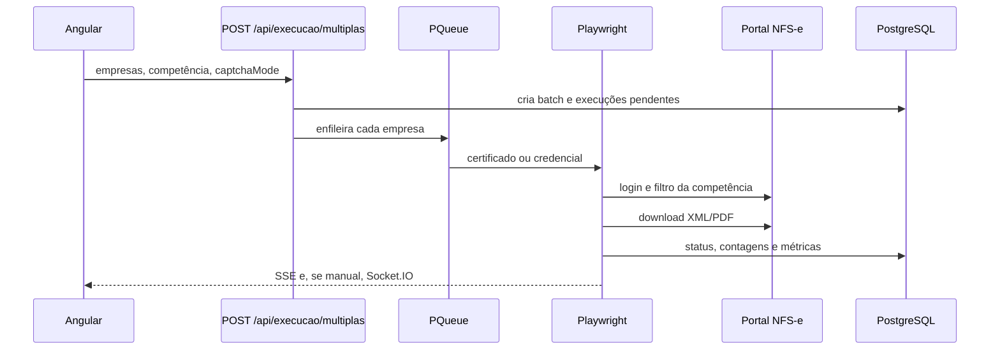

# Fluxo da automação

Este documento descreve o caminho que uma execução percorre no código atual. Daqui a seis meses, comece por `Backend/src/routers/execucao.ts` e `Backend/src/services/execution-service.ts`.

## Como começa

1. A tela de execução chama `GET /api/execucao/companies/summary` e `GET /api/execucao/companies` com `contabilidade_id`.
2. Só entram empresas aptas (`OPERACIONAL` ou `ATENCAO`), calculadas em `execution-summary.service.ts`.
3. O operador envia `POST /api/execucao/multiplas` com empresas, `dataInicio`, `dataFim`, tipo (`emitidas`, `recebidas` ou `ambas`), `headless`, `baixarPdf` e `captchaMode` (`TWO_CAPTCHA` ou `MANUAL`).
4. O router gera um `batch_id`, valida CNPJ e empresa, grava o lote em `automation_execution_batches` e enfileira cada item.
5. A resposta volta com `batch_id` antes de os browsers terminarem. O andamento segue por SSE e por `GET` de status do lote.

Quem dispara é o usuário na interface. Não há agendador interno.

## O que chama o quê

| Etapa | Módulo |
|---|---|
| Fila e concorrência | `services/execution-service.ts` |
| Login por certificado A1 | `automation/playwright-nfse.ts` |
| Login por CNPJ/CPF e senha | `automation/login-credencial-nfse.ts` |
| Validação avulsa de credencial | `automation/validar-credencial-nfse.ts` |
| Navegação e filtro | `automation/playwright-nav.ts`, `automation/processar-notas-competencia.ts` |
| Download | `automation/download-manager.ts`, `automation/download-operation.ts` |
| Captcha | `automation/captcha/*`, `automation/captcha-solver.ts` |
| Central manual | `services/manual-captcha.service.ts` e Socket.IO |
| Carga do PFX | `services/certificate-loader.ts` |

## Empresas e autenticação

Cada item traz `tipo_autenticacao`: `certificado` ou `credenciais`.

- Certificado: o loader busca o registro em `certificados_digitais`, lê o PFX no storage e decifra a senha. O Playwright registra o certificado para `www.nfse.gov.br` e `certificado.nfse.gov.br`.
- Credencial: a senha cifrada em `credenciais` é decifrada só na hora do login. O formulário do portal recebe documento e senha.

`CAPTCHA` em modo `MANUAL` força navegador visível. No container, o Xvfb fornece esse display. Fora do Docker, o Chromium abre na máquina do operador.

## Navegação e download

Depois do login, o fluxo abre o dashboard, preenche a competência, filtra e percorre as tabelas de notas emitidas e/ou recebidas. Cada XML/PDF passa pelo gerenciador de download. A pasta segue `downloadsBasePath` + padrão `{cnpj}/{ano}/{mes}` das settings. No container, a base esperada é `/app/downloads`, montada em `/srv/data/autonacional/downloads`.

## Captcha e retries

A configuração padrão tenta o 2Captcha e pode cair para resolução manual (`CAPTCHA_MODE=auto_manual` no ambiente; o lote ainda escolhe `TWO_CAPTCHA` ou `MANUAL`).

Por operação de download, o código fecha o modal, relocaliza a nota e pede outro captcha. Os limites vêm de `CAPTCHA_OPERATION_MAX_ATTEMPTS`, do delay entre tentativas e de `CAPTCHA_CONSECUTIVE_FAILURE_LIMIT`. Esgotadas as tentativas automáticas, o fallback manual depende de `CAPTCHA_OPERATION_FALLBACK_MANUAL`.

A Central manual recebe o desafio por Socket.IO, no lote `execucao/captchas/:batchId`. Cliques remotos e token continuam no mesmo browser da execução.

Relatórios de diagnóstico do 2Captcha vão para `logs/2captcha-report`. A chave da API é mascarada. Esses arquivos são temporários e entram na limpeza por idade.

## Persistência

Durante a execução o processo atualiza `execucoes` (status, etapa, progresso, quantidades, erro). Ao fim, grava também `automation_executions` e os logs de lote (`execucao_log_batch` / `execucao_log_item`, além de `execucao_batch_log` quando o fluxo de logs em lote é acionado).

Estados usados no código: `pendente`, `em_execucao`, `concluido`, `falhou`.

## Erros

Falha de login, página fechada, captcha sem solução ou timeout marcam a empresa como `falhou`, emitem SSE `execution:finished` e seguem para a próxima da fila. Uma empresa não derruba o processo.

`GET /health` devolve 503 se o `SELECT 1` no PostgreSQL falhar. A mensagem pública não inclui a connection string.

## Concorrência e encerramento

A fila é em memória. Reiniciar o processo perde o que ainda não tinha sido persistido como concluído ou falho. Itens ainda `pendente` no momento do SIGTERM/SIGINT são gravados como `falhou` com mensagem de encerramento. Execuções já no browser têm a página fechada; o `finally` existente grava a falha.

O encerramento, em `main.ts`:

1. para o timer de limpeza;
2. fecha o HTTP e as conexões SSE;
3. pausa a fila, descarta jobs não iniciados e fecha browsers ativos;
4. espera a fila ficar ociosa, no máximo 20 segundos;
5. fecha o cliente SFTP, se estiver em uso;
6. chama `prisma.$disconnect()`;
7. encerra o processo.

Se isso passar de 30 segundos, o processo sai com código 1. O Compose espera até 40 segundos (`stop_grace_period`).

## Onde pode falhar

- `DATABASE_URL` incorreta ou rede `vinylab_internal` ausente
- diretório de certificados vazio, permissão negada ou caminho diferente do gravado no banco
- Chromium sem as bibliotecas do sistema, sem `/dev/shm` ou sem `PLAYWRIGHT_NO_SANDBOX` dentro do container
- portal NFS-e fora do ar, captcha sem saldo ou desafio diferente do seletor atual
- settings de download apontando para um caminho absoluto de outra máquina, fora do volume
