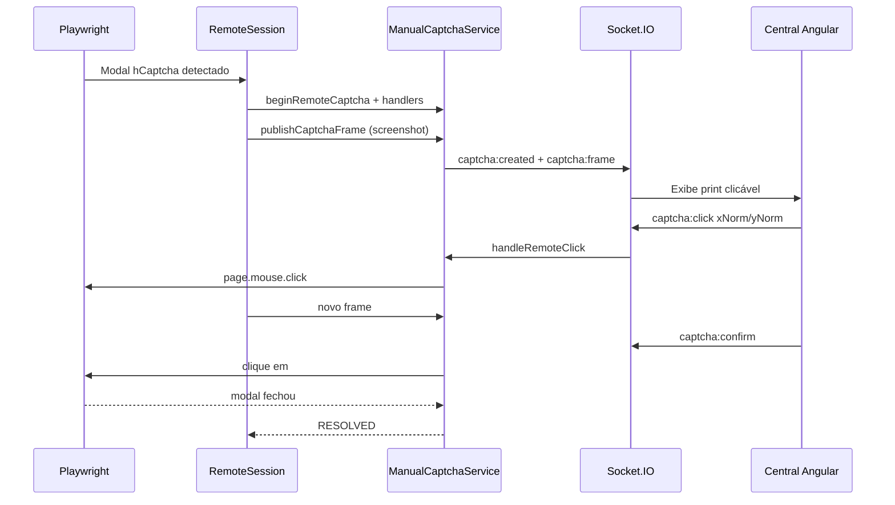

# Central Manual de Captchas

> Resolução manual de hCaptcha em lote, integrada à tela de Execução de Processos e à automação Playwright do portal NFSe Nacional.

---

## 1. Visão geral

A **Central Manual de Captchas** permite escolher, antes de iniciar um lote, se os desafios hCaptcha serão resolvidos pela **2Captcha** (comportamento atual) ou por um **operador humano** em uma tela Angular dedicada.

| Modo | Valor | Comportamento |
| ---- | ----- | ------------- |
| Automático — 2Captcha | `TWO_CAPTCHA` (padrão) | Fluxo existente via `captcha-solver.ts` |
| Manual — Central | `MANUAL` | Playwright envia **print** do navegador; operador **clica** na Central; cliques são reaplicados no browser (`remote_click`) |

O SSE da tela de execução **permanece** para status geral. O Socket.IO é usado **somente** para publicação/resolução de captchas manuais.

> O modo MANUAL **não** renderiza um widget hCaptcha novo no Angular (isso falhava em localhost e gerava token de outro desafio). O operador interage no **mesmo** desafio aberto no Playwright.



---

## 2. Fluxo de seleção do modo

1. Na tela `/execucao`, o usuário escolhe **Modo de resolução de captcha**.
2. Ao clicar em **Iniciar**, o frontend envia `captchaMode` em `POST /api/execucao/multiplas`.
3. O modo fica associado ao `batch_id` e é propagado para cada tarefa da PQueue → `processar-notas` → `download-operation`.
4. Se `MANUAL` e houver `batch_id`, o botão **Abrir Central de Captchas** fica habilitado e abre `/execucao/captchas/:batchId` em nova guia.

---

## 3. Fluxo de resolução (modo MANUAL)

1. Playwright detecta o modal `#btnSubmitHCaptcha`.
2. Extrai metadados e tira **screenshot do viewport**.
3. Emite SSE `execution:stage` com `captcha_aguardando_central`.
4. `beginRemoteCaptcha()` cria a sessão e emite `captcha:created` + `captcha:frame`.
5. A Central exibe o print; o operador **clica na imagem** (coordenadas normalizadas 0..1).
6. Backend aplica `page.mouse.click` no Playwright e republica o frame.
7. Operador clica **Confirmar no portal** (`#btnSubmitHCaptcha`) ou o modal fecha após os cliques.
8. Sessão resolve (`RESOLVED` por `remote_click`/`confirm`); a automação continua.

---

## 4. Eventos Socket.IO

### Frontend → Backend

| Evento | Payload |
| ------ | ------- |
| `captcha:join-batch` | `{ batchId }` |
| `captcha:leave-batch` | `{ batchId }` |
| `captcha:click` | `{ batchId, captchaId, xNorm, yNorm }` + ack |
| `captcha:refresh` | `{ batchId, captchaId }` + ack |
| `captcha:confirm` | `{ batchId, captchaId }` + ack |
| `captcha:skip` | `{ batchId, captchaId }` + ack |

### Backend → Frontend

| Evento | Quando |
| ------ | ------ |
| `captcha:created` | Novo desafio |
| `captcha:frame` | Novo screenshot (JPEG base64) |
| `captcha:batch-state` | Snapshot ao entrar na sala (inclui `latestFrame` se houver) |
| `captcha:resolved` / `captcha:removed` / `captcha:expired` | Remoção do card |
| `captcha:error` | Falha de validação |

Sala: `captcha-batch:{batchId}`.

---

## 5. Contratos principais

```ts
type CaptchaMode = 'TWO_CAPTCHA' | 'MANUAL';

interface ManualCaptchaRequest {
  captchaId: string;
  batchId: string;
  executionId: string;
  empresaId: string;
  empresaNome: string;
  cnpj: string;
  siteKey: string;
  pageUrl: string;
  rqdata?: string;
  createdAt: string;
  expiresAt: string;
  timeoutSeconds: number;
}
```

A correlação da resposta usa **`captchaId`** (nunca só CNPJ/empresa).

---

## 6. Arquivos criados

### Backend

- `src/automation/captcha/types.ts`
- `src/automation/captcha/two-captcha.provider.ts`
- `src/automation/captcha/manual-captcha.provider.ts`
- `src/automation/captcha/get-captcha-provider.ts`
- `src/automation/hcaptcha-page.ts` (detecção/injeção compartilhada)
- `src/services/manual-captcha.service.ts`
- `src/infrastructure/socket.ts`
- Testes: `manual-captcha.service.test.ts`, `get-captcha-provider.test.ts`

### Frontend

- `src/app/components/central-captchas/*`
- `src/app/services/captcha-central.service.ts`
- `src/app/models/manual-captcha.model.ts`
- `src/app/utils/hcaptcha-loader.ts`
- `src/app/services/captcha-central.service.spec.ts`

---

## 7. Arquivos alterados

- `Backend/src/main.ts` — `http.Server` + Socket.IO
- `Backend/src/routers/execucao.ts` — valida/propaga `captchaMode`
- `Backend/src/services/execution-service.ts` — modo no lote + cancelamento ao finalizar
- `Backend/src/automation/processar-notas-competencia.ts` — resolver central
- `Backend/src/automation/download-operation.ts` / `download-operation-types.ts`
- `Backend/src/infrastructure/config.ts` — `MANUAL_CAPTCHA_TIMEOUT_MS`
- `Frontend` tela `execucao` (modo, botão, status `AGUARDANDO_CAPTCHA`)
- `Frontend/src/app/app.routes.ts` — rota da Central
- `docs/README.md`

---

## 8. Timeout e Pular

- Timeout padrão: **120 segundos** (`MANUAL_CAPTCHA_TIMEOUT_MS`, configurável).
- Ao expirar ou **Pular**: Promise retorna `TIMEOUT` / `SKIPPED` → `CaptchaError(ERROR_CAPTCHA_UNSOLVABLE)` → retry existente (fecha modal, regenera desafio, republica na Central).
- Não encerra a empresa só por uma tentativa expirada.

---

## 9. Persistência

Somente **memória**. Sem Redis/banco. Reinício do backend ou F5 na Central não recupera desafios anteriores. Timers e Maps são limpos em resolve/skip/timeout/cancel.

---

## 10. Dependências

| Pacote | Onde |
| ------ | ---- |
| `socket.io` | Backend |
| `socket.io-client` | Frontend |

### Variáveis de ambiente

| Variável | Padrão | Descrição |
| -------- | ------ | --------- |
| `MANUAL_CAPTCHA_TIMEOUT_MS` | `120000` | Timeout da Central Manual |
| `CORS_ORIGINS` | localhost:4200/1234 | Origens aceitas pelo Socket.IO |

`CAPTCHA_MODE` (auto/manual/auto_manual) do ambiente continua valendo **apenas** no modo de lote `TWO_CAPTCHA`.

---

## 11. Como executar

```bash
# Backend
cd Backend
npm install
npm run dev

# Frontend
cd Frontend
npm install
npm start
```

### Testes

```bash
cd Backend && npm test
cd Frontend && npm test   # inclui captcha-central.service.spec.ts
```

---

## 12. Validação manual sugerida

1. Iniciar lote com modo **Manual** e abrir a Central.
2. Forçar um hCaptcha no portal (download de nota).
3. Confirmar card na Central (empresa, CNPJ, timer, widget).
4. Resolver e ver a linha voltar para **Executando**.
5. Testar **Pular** e timeout (aguardar 2 min).
6. Confirmar que outras empresas continuam baixando em paralelo.
7. Repetir com modo **2Captcha** e garantir comportamento anterior.

### Limitação do widget

O hCaptcha pode restringir o `sitekey` ao domínio do portal NFSe. Se o widget não carregar em `localhost`, a Central ainda recebe o desafio e o erro fica visível no card; a injeção no Playwright permanece correta quando o token é obtido. Em produção, hospede o frontend em domínio compatível ou use proxy/CSP adequados conforme política do hCaptcha.
